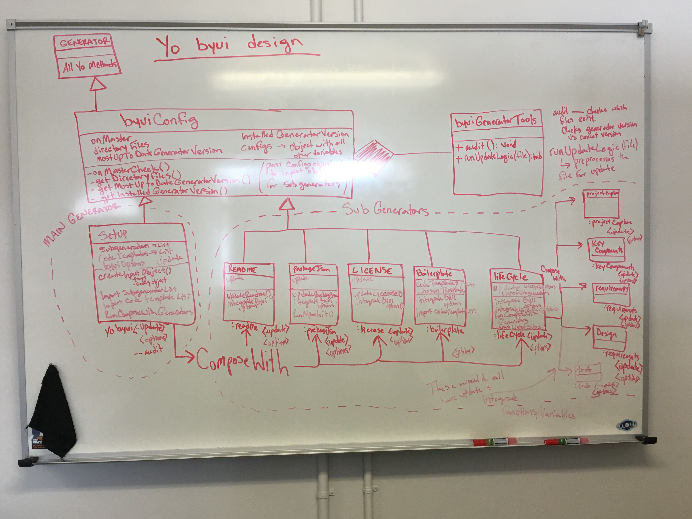

# Key Components Doc for generator-byui
#### *Author: Ryan Gewondjan*
#### *Date: 4-9-2019*

# Preliminary Design

## Magic Box Chart



<!-- Think through the process as much as makes sense, and then create a magic box chart with the whiteboard and place it here. -->

## Explanation of Design

This is an object oriented design, and there is a lot going on.

To start the ```generator``` class in the upper left hand corner is the class that yeoman starts with, and we inherit off that class.

Next we have the ```byuiConfig``` class which inherits from the ```generator``` class. This class contains all byui's configurations of the generator, so when we want to create a generator, we most always should inherit from the byuiConfig class. (There may be times when this is not the case, but for now, this way seems best.)

The ```byuiConfig``` class HAS-A an instance of the ```byuiGeneratorTools``` class which contains a suite of tools (functions) that are useful and in some cases necessary for certain checks (such as checking if we are on the master branch or not).

Next we have the ```setUp``` generator. This inherits from the ```byuiConfig``` generator. The setUp generator composesWith many sub generators.

If you composeWith a generator, the sub generator that is composedWith does not inherit from the generator that called it. Instead these generators work side by side.

Next we have the sub generators: ```readMe```, ```packageJson```, ```license```, ```boilerplate```, and ```lifeCycle``` which are all called (using composeWith) from ```setUp```.  These generators do the necessary logic to generate what their name implies.

Finally the ```lifeCycle``` sub generator uses two other sub generators (calls them using composeWith). These generators are ```capture``` and ```keyComponents``` which generate the documents which their names imply.

### Used Libraries

- child_process
- chalk
- https
- yeoman-generator
- path
- fs
- moment


-----

#### *Preliminary Design Approved By:* 
#### *Preliminary Design Approval Date:*

# Full Design

## Component Diagrams
<!-- Diagrams and companion explanations for all Key Components.
These would include information about inputs, outputs, and what a function does for every major function. -->

<!-- For each component, the following template will be followed: (In other words, the template below will repeat for each component)-->

### *Insert Component name here*

Diagram:

*Insert Diagram Here*

Explanation:

*Insert Explanation here*

<!-- For a future release:
## Test Plans
For each major function the test plan template will be as follows (in other words the template below will repeat for each test) 
### *Insert name of component here (e.g. convertIdToCourseObject function)*
#### Test 1: *Insert Test name here*
Summary: 
 *Insert Test Summary Here*
 Type: *Insert Type here (Unit Test, Manual Test, Selenium/Puppeteer test (Overkill?))* 
Procedure:
1. *Insert Steps here*
1. *and here*
1. *and here*
Expected Outcome:
*Insert Expected Outcome here*
-->

## Test Plans

### *Insert Module Name Here*
#### How to Test:


-----

#### *Full Design Approved By:* 
#### *Full Design Approval Date:*


<!-- Diagram Types:
 - Data Flow (I think this will be the most popular)
 - Structure Charts (This is really good for showing input and output of every function)
 - UML Class Diagram (a must for object oriented projects) -->


